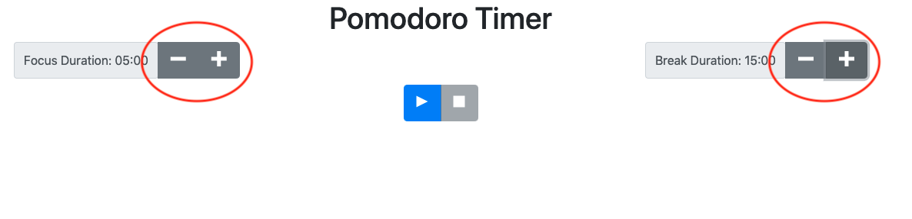
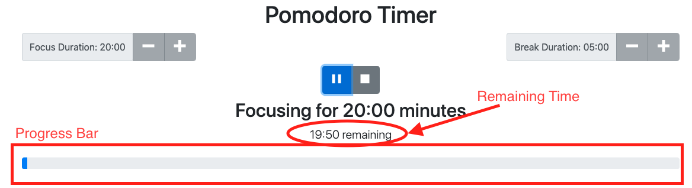
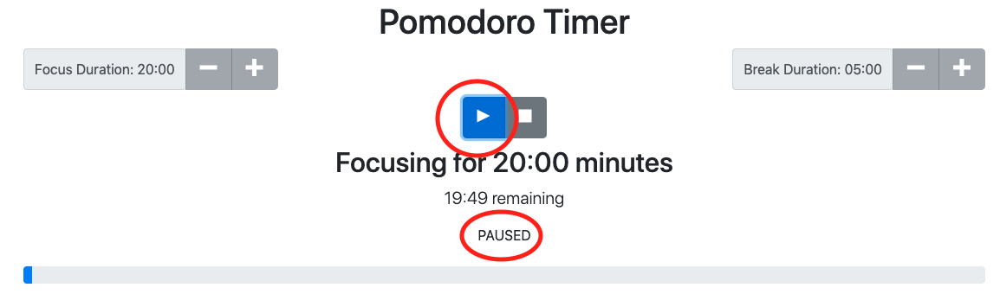
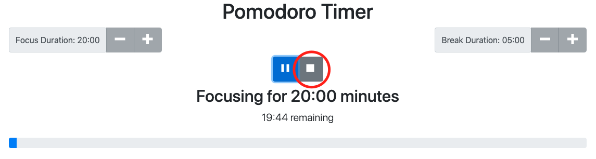

# Pomodoro Timer
## A React based app to utilize the Pomodoro focusing method [Ready for Use](pomodoro-timer-weld.vercel.app)
for more information on the Pomodoro method, click [here](https://todoist.com/productivity-methods/pomodoro-technique)

## Step 1: Set how long user will focus and how long your break will be
 
 
 
 - Focus time changes in increments of five minutes with a limited range of 5-60 minutes
 - Break time changes in increments of one minute in the range 1-20 minutes
 
## Step 2: Press play and your timer starts.
  
  
  
  - User may see how much time is left in a session precisely, or at a glance look at the progress bar
  - Once the timer finishes an alarm will sound, telling you to take a break or get back to work. The next session will immediately begin afterwards 
  
  
  
  - If the user is interrupted, a session may be paused an resumed using the pause/play button
 
## Step 3: Stop your Pomodoro Session
  
  
  
  - When user finishes working, they may stop the timer by pressing the stop button
  - This action returns the page to the original state
  

